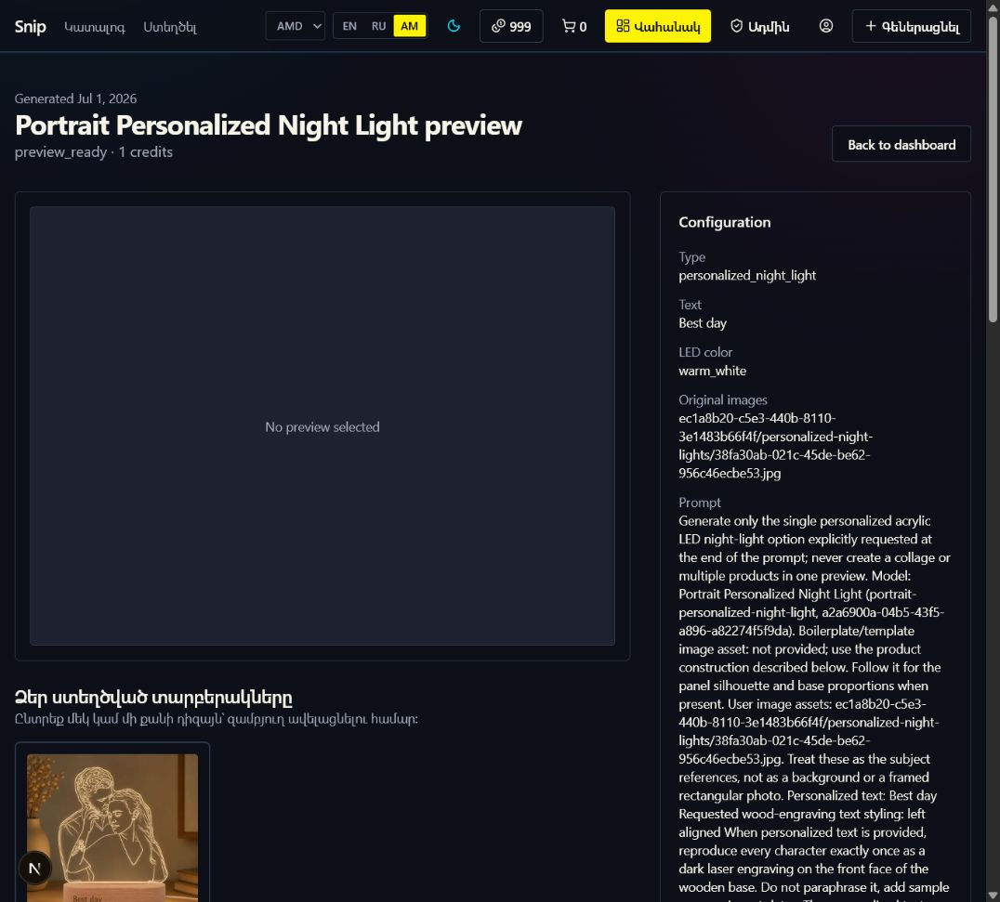
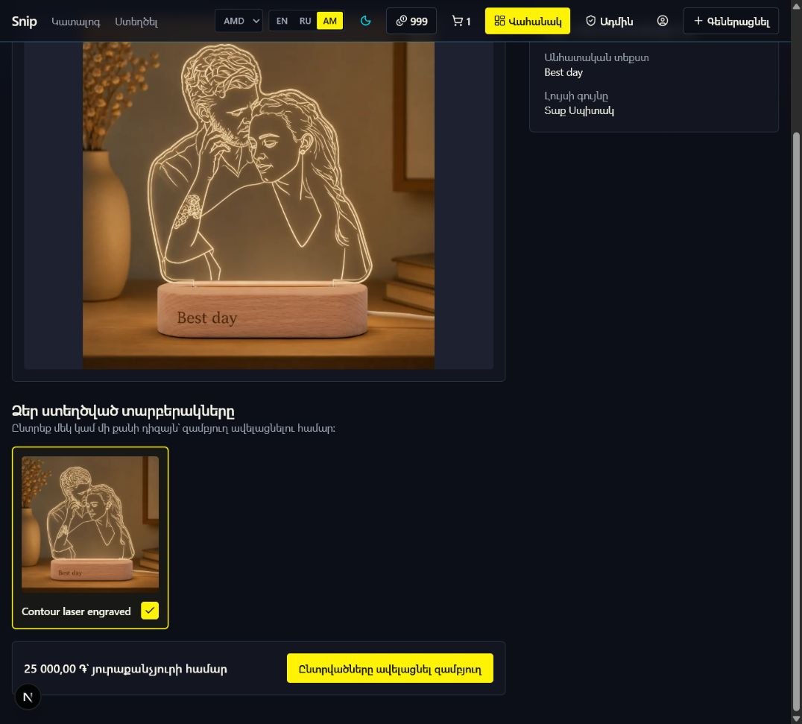

# Generated Item UI Audit

Date: 2026-07-02

Surface: `/generated/04588c59-0772-4704-897f-167fda4c8cbc`

## Step 1 — Generated item review before fixes

Health: Poor

- The main preview was empty even though a generated option was available below it.
- No option was selected by default, leaving the primary cart action without a useful starting state.
- The right panel exposed internal storage paths, the full generation prompt, raw enum values, and duplicated credit information.
- Armenian mode mixed Armenian navigation with English page labels and raw identifiers.
- Screenshot review cannot confirm complete keyboard or screen-reader behavior.

## Step 2 — Generated item review after fixes

Health: Good

- The first generated option is selected and displayed in the main preview immediately.
- Selecting another option also makes it the active large preview while preserving multi-select cart behavior.
- The sidebar now contains only personalized text and light color.
- Page labels, dates, statuses, colors, actions, empty states, and option names use English, Russian, or Armenian content.
- The selector uses native checkboxes, visible focus treatment, semantic headings, optimized images, and localized alternative text.

## Verification limits

- The cart submission was not activated because it would change the user's cart.
- Visual evidence covers the current desktop viewport; responsive layout is supported by the existing breakpoints but was not separately captured in this pass.
